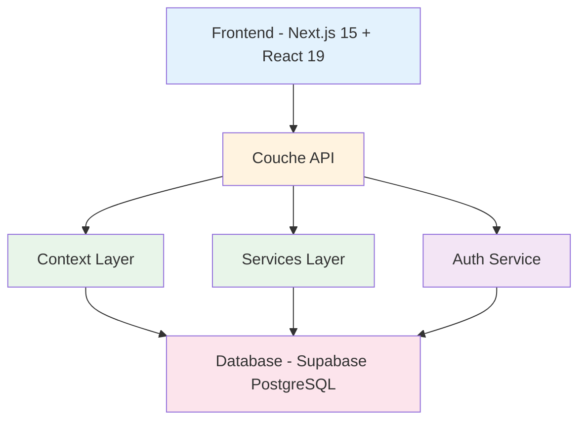
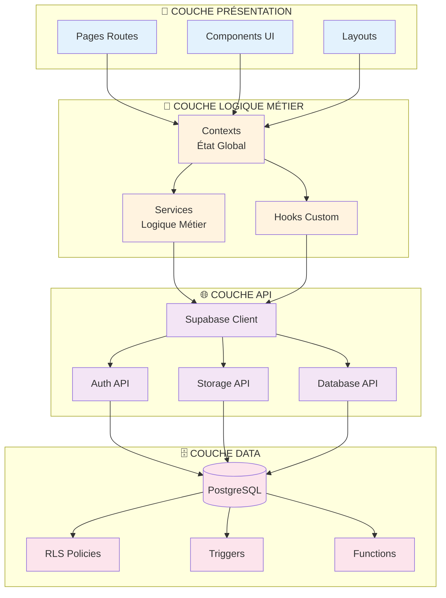
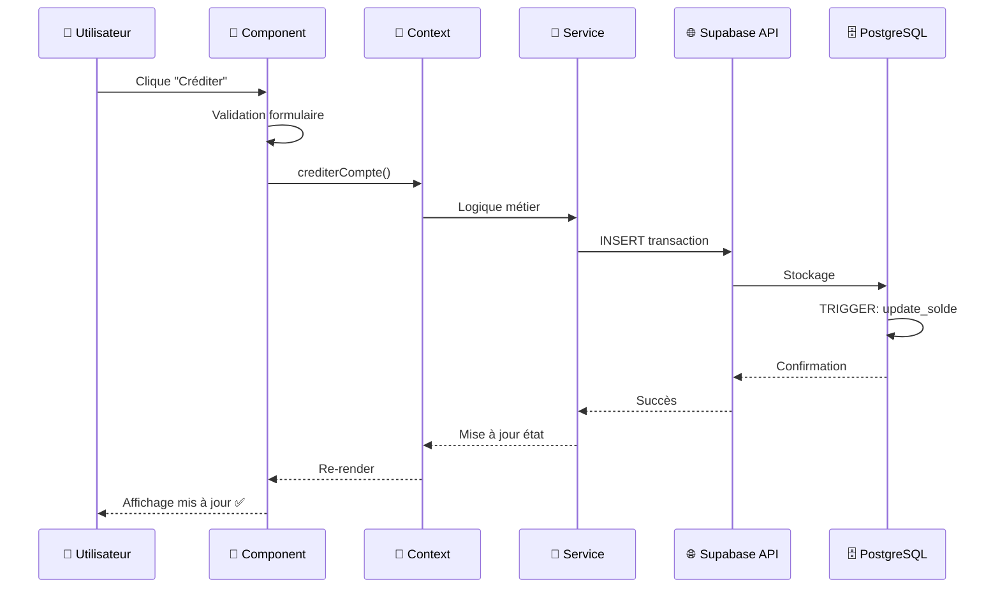
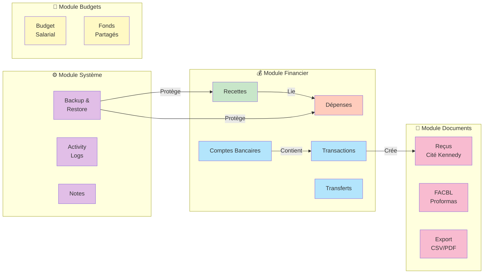
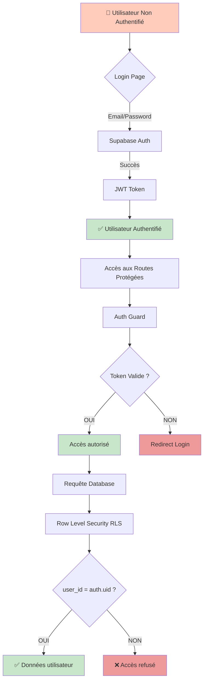
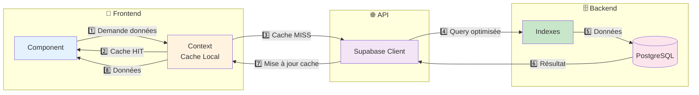
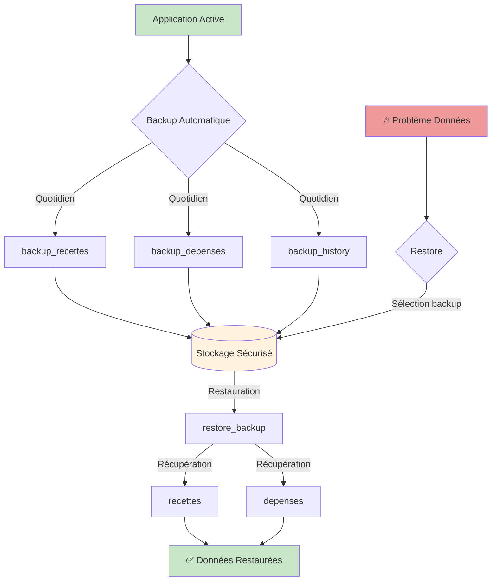

# 🎨 Diagrammes d'Architecture EDDO-BUDG

## 📊 Diagramme 1 : Vue d'ensemble (Style de l'image fournie)



---

## 📊 Diagramme 2 : Architecture Détaillée Multi-Couches



---

## 📊 Diagramme 3 : Flux de Données (Exemple Transaction)



---

## 📊 Diagramme 4 : Modules Fonctionnels



---

## 📊 Diagramme 5 : Structure des Dossiers

```mermaid
graph TD
    ROOT[eddo-budg/]
    
    ROOT --> SRC[src/]
    ROOT --> SUPA[supabase/]
    ROOT --> PUBLIC[public/]
    
    SRC --> APP[app/]
    SRC --> COMP[components/]
    SRC --> CTX[contexts/]
    SRC --> LIB[lib/]
    SRC --> HOOKS[hooks/]
    
    APP --> PROT[(protected)/]
    APP --> AUTH[auth/]
    APP --> API[api/]
    
    PROT --> ACCUEIL[accueil/]
    PROT --> COMPTES[comptes-bancaires/]
    PROT --> RECETTES[recettes/]
    PROT --> DEPENSES[depenses/]
    PROT --> RECEIPTS[receipts/]
    PROT --> FACBL[facbl/]
    
    COMP --> UI[ui/]
    COMP --> FORMS[forms/]
    COMP --> CARDS[cards/]
    
    CTX --> RCTX[recette-context]
    CTX --> DCTX[depense-context]
    CTX --> CCTX[compte-context]
    
    LIB --> SLIB[supabase/]
    LIB --> UTILS[utils/]
    
    SUPA --> MIG[migrations/]
    
    style ROOT fill:#1976d2,color:#fff
    style SRC fill:#43a047,color:#fff
    style SUPA fill:#e65100,color:#fff
    style APP fill:#f57c00
    style COMP fill:#c2185b
    style CTX fill:#7b1fa2
    style LIB fill:#303f9f
```

---

## 📊 Diagramme 6 : Sécurité & Authentification



---

## 📊 Diagramme 7 : Performance & Cache



---

## 📊 Diagramme 8 : Backup & Restore



---

## 🎯 Légende des Couleurs

| Couleur | Signification |
|---------|---------------|
| 🔵 Bleu | Frontend / UI |
| 🟠 Orange | Logique Métier / Contexts |
| 🟣 Violet | API / Services |
| 🔴 Rose | Base de données |
| 🟢 Vert | Succès / Validation |
| ⚫ Gris | Système / Infrastructure |

---

## 📝 Conclusion

Ces diagrammes illustrent une **architecture moderne, robuste et évolutive** :

✅ **Séparation claire des responsabilités**  
✅ **Flux de données unidirectionnel**  
✅ **Sécurité à tous les niveaux**  
✅ **Performance optimisée**  
✅ **Scalabilité garantie**

L'application **EDDO-BUDG** est **bien structurée** et prête pour une utilisation en production ! 🚀


